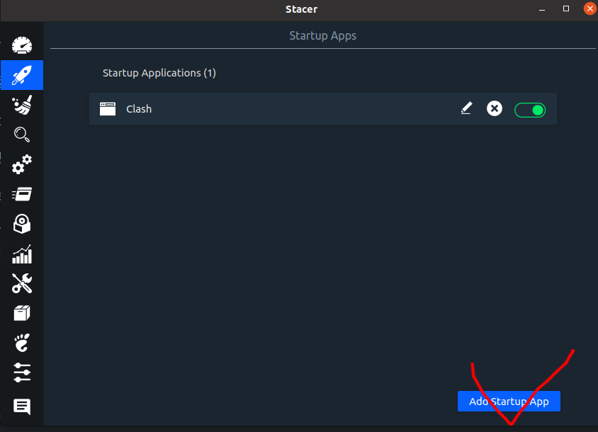
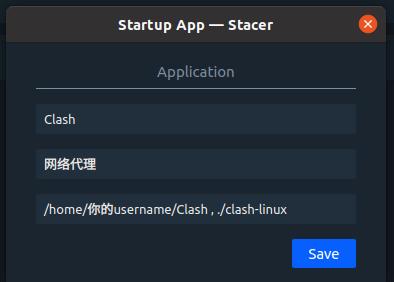
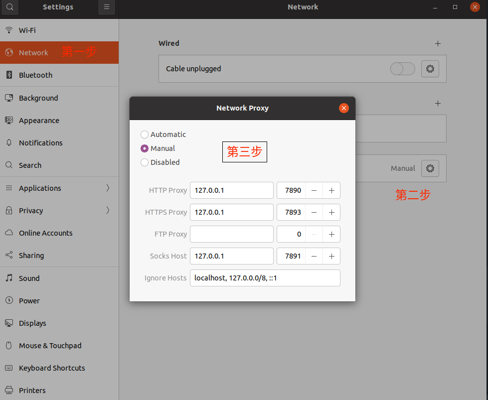

## Clash-linux Setting On Ubuntu20.04

## Clash-linux 在Ubuntu20.04环境下面的配置

1、解压clash-linux.zip

2、chmod +x clash-linux

3、运行 ./clash-linux

3、cd ~/.config/clash

4、把 chache.db 、 config.yaml (请自行通过订阅好的机场下载)、 Country.mmdb 放在 ~/.config.clash 里面

5、reboot电脑

6、打开stacer 配置开机自启动

7、Stacer 配置Clash开机自启动

8、代理网络配置

---

## 如有侵权违规 请联系作者[Email](eejackyang.gxnu@vip.163.com)
